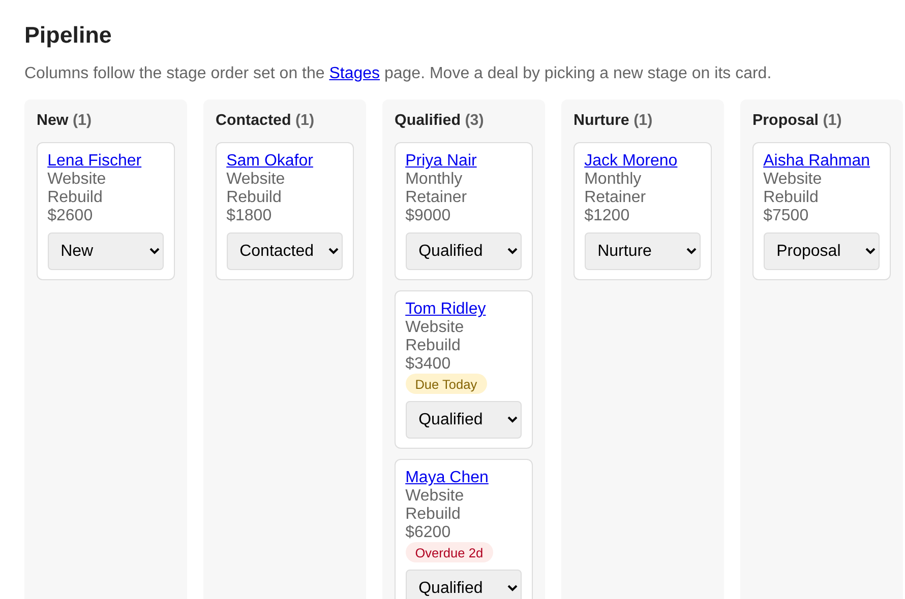

# agent-crm

**A small CRM your AI agent can work.** It exposes an MCP endpoint so an agent
can search contacts, run the call queue, log calls and move deals, without being
able to delete anything or send email. A plain web app shows you everything it did.

[](LICENSE)
[](https://github.com/sevasek/agent-crm/actions/workflows/ci.yml)



FastAPI, sqlite, Jinja2, Docker. One container, one database file, no external services.

> **Status: pre-1.0.** The MCP tool set and the schema may change between
> releases. Back up `data/crm.db` before upgrading.

## Who it's for

**A good fit** if you are one person (a solo consultant, a small clinic, a
tradie) who sells through calls and follow-ups, and you want an agent to do the
CRM busywork while you keep a clear view of the pipeline.

**Not a fit** if you need multiple users with roles and permissions, email sent
and received inside the CRM, reports and dashboards, or a native mobile app.
These are left out on purpose; see [`docs/SCOPE.md`](docs/SCOPE.md).

## Quick start

For trying it out. `docker-compose.yml` is a development setup with live reload;
see [Production](#production) for a real deployment.

```bash
git clone https://github.com/sevasek/agent-crm.git && cd agent-crm
cp .env.example .env
docker compose up --build -d
docker compose exec app python scripts/create_admin.py you@example.com "Your Name"
docker compose exec app python scripts/seed_services.py   # optional example services
```

Open http://localhost:8000 and log in.

## Connect an agent

Generate a key, put it in `.env` as `CRM_MCP_API_KEY`, and recreate the container
(a plain restart does not reload `.env`):

```bash
python -c "import secrets; print(secrets.token_hex(32))"
docker compose up -d
```

Then point any MCP client at `http://localhost:8000/mcp` (Streamable HTTP) with
`Authorization: Bearer <key>`. Check it works:

```bash
curl -sS http://localhost:8000/mcp \
  -H "Content-Type: application/json" -H "Accept: application/json" \
  -H "Authorization: Bearer $CRM_MCP_API_KEY" \
  -d '{"jsonrpc":"2.0","id":1,"method":"tools/list"}'
```

An agent can search contacts (`search_partners`), pull today's queue
(`get_call_queue`), log what happened (`record_call_outcome`, `log_activity`),
and move deals (`set_deal_stage`). It cannot delete records, send email, manage
users, or reshape the pipeline. Tools tell the agent to search before it creates,
and updates fill empty fields instead of overwriting yours.

Hosted connectors that need OAuth 2.1 with PKCE can use `/oauth/authorize`.
Full tool list, auth and limits: [`docs/MCP.md`](docs/MCP.md).

## What's inside

- Companies and people in one table; people link to their company.
- Deals on a pipeline you define: stage names, order and roles are data.
- A next action and date on every deal, with due and overdue flags and a daily
  check that logs each due follow-up on the contact's timeline.
- A daily call list ranked out of 100 by a fixed formula you can read (deal
  value, source, contact completeness, recency).
- A phone-first call view with tap-to-call, the offer to pitch, and one-tap outcomes.
- Weighted fit rules, a service catalogue and priced offers you configure.
- Lead ingest over an API or CLI, with duplicate matching.
- Delegated tasks to hand work to another agent or a person, with an optional webhook.
- An optional webhook when a deal enters a nurture stage.

It starts empty apart from a starter pipeline: services, offers and fit rules
are yours to define. Judgement lives in your agent, not in the CRM; scores are
plain formulas, not a model.

## Production

```bash
docker compose -f docker-compose.yml -f docker-compose.prod.yml up -d --build
```

The app binds to `127.0.0.1:${CRM_PORT:-8000}` (default 8000). Put a
TLS-terminating reverse proxy in front and forward everything, including
`/mcp` and `/oauth/*`. Working Caddy and nginx configs, header forwarding, and
`TRUSTED_PROXIES` notes are in [`docs/DEPLOY.md`](docs/DEPLOY.md). In `.env`:

- `SECRET_KEY`: a real one, not the placeholder.
- `SECURE_COOKIES=true` and `BASE_URL=https://your.domain`.
- `TRUSTED_PROXIES`: your proxy's IP, a CIDR (e.g. the compose network `172.18.0.0/16`), or a hostname, so rate limits use the real client IP.
- `TZ`: decides what "today" means for follow-ups.

Security defaults: login uses expiring session cookies with CSRF protection;
login and API endpoints are rate limited (failed auth is counted per IP;
authenticated MCP/API traffic has a larger per-key bucket); the lead-ingest,
stages and MCP keys are separate, and each endpoint refuses all requests until
its key is set. Set `BOOTSTRAP_ADMIN_EMAIL` and `BOOTSTRAP_ADMIN_PASSWORD_FILE`
(preferred; wins over `BOOTSTRAP_ADMIN_PASSWORD`) once to create the first
admin without shell access — the file is not visible in `docker inspect`.
`/health` checks that sqlite is writable and returns 503 if it is not.

The `staleness-cron` service runs the follow-up check on start and daily at 08:00.

Production compose rotates json-file logs at 10 MB × 5 files and caps the app
at 256 MB RAM. `docker stop` / `docker kill` leave the container stopped under
`restart: unless-stopped` — a maintenance stop is not a crash, so start it
again with `docker compose ... up -d` when you are done.

Once a `v*` tag exists, you can run a published multi-arch image instead of
building from the working copy (`build: .` stays the default):

```yaml
# compose override (a third -f file, or docker-compose.override.yml)
services:
  app:
    image: ghcr.io/sevasek/agent-crm:vX.Y.Z
    build: !reset
    pull_policy: always
  staleness-cron:
    image: ghcr.io/sevasek/agent-crm:vX.Y.Z
    build: !reset
    pull_policy: always
```

Then `docker compose -f docker-compose.yml -f docker-compose.prod.yml up -d`
(no `--build`) so Compose pulls the published image instead of building locally.

See [`CHANGELOG.md`](CHANGELOG.md) for what changed between tags.

### Backup, restore and upgrade

All data is one sqlite file, `./data/crm.db`, in WAL mode. Do not `cp` it while
the app runs: you can copy a torn database. Use sqlite's online backup, which is
safe under load (the image has no `sqlite3` CLI, so this uses Python):

```bash
docker compose exec -T app python -c "import sqlite3,sys; s=sqlite3.connect('data/crm.db'); d=sqlite3.connect(sys.argv[1]); s.backup(d); d.close()" data/backup-$(date +%F).db
```

Daily at 03:00 from the host's crontab (adjust the path; keeps 14 days), then
copy `./data/backup-*.db` off the machine:

```cron
0 3 * * * cd /path/to/agent-crm && docker compose -f docker-compose.yml -f docker-compose.prod.yml exec -T app python -c "import sqlite3,sys; s=sqlite3.connect('data/crm.db'); d=sqlite3.connect(sys.argv[1]); s.backup(d); d.close()" data/backup-$(date +\%F).db && find data -name 'backup-*.db' -mtime +14 -delete
```

Restore:

```bash
docker compose -f docker-compose.yml -f docker-compose.prod.yml down
rm -f data/crm.db-wal data/crm.db-shm      # stale WAL files would corrupt the restore
cp data/backup-YYYY-MM-DD.db data/crm.db
docker compose -f docker-compose.yml -f docker-compose.prod.yml up -d
```

The entrypoint fixes ownership of `./data` on start. Check `docker compose ps`
shows `healthy` and you can log in.

Upgrade: take a backup, then `git pull` and re-run the `up -d --build` command
above. There is no migration tool: schema changes are applied by `init_db()` on
startup. Before jumping several versions, read `git log -p -- app/database.py`
for the range, and test on a copy of the backup first. To roll back, `down`,
`git checkout` the previous version, and restore the backup taken before the
upgrade (a newer schema may not open cleanly on older code).

## Ingest leads

`POST /api/v1/leads` with `X-API-Key: $CRM_API_KEY` (header only), or from the CLI:

```bash
python scripts/inject_leads.py --dry-run tests/fixtures/leads/example.json
python scripts/inject_leads.py tests/fixtures/leads/example.json
```

`service_slug` must already exist in your catalogue. Field meanings and matching
rules are in [`docs/DATA_MODEL.md`](docs/DATA_MODEL.md). To load contacts from
markdown files, see `scripts/import_clients.py`.

## Docs

[`SCOPE.md`](docs/SCOPE.md) what's in and out and why ·
[`DATA_MODEL.md`](docs/DATA_MODEL.md) entities, schema and ingest rules ·
[`MCP.md`](docs/MCP.md) the agent interface ·
[`DEPLOY.md`](docs/DEPLOY.md) reverse proxy and TLS

## Contributing

Planned work, known gaps and deferred ideas are tracked in
[GitHub Issues](https://github.com/sevasek/agent-crm/issues); there is no separate
TODO file. The scope is deliberately narrow, so please open an issue to discuss a feature
before sending a pull request. Bug fixes are welcome directly. Run the tests
first:

```bash
pip install -r requirements-dev.txt
python -m pytest tests/ -q
```

## Support and security

Questions and bugs: open an issue. To report a vulnerability, use the
[private security report form](https://github.com/sevasek/agent-crm/security/advisories/new)
rather than a public issue (see [`SECURITY.md`](SECURITY.md)).

Want it run for you? Managed hosting is $60 AUD per month and includes secure
hosting, backups, 99.9% uptime, new features deployed frequently, and responsive
support for feature requests: https://sevasek.com/crm

## License

[MIT](LICENSE)
